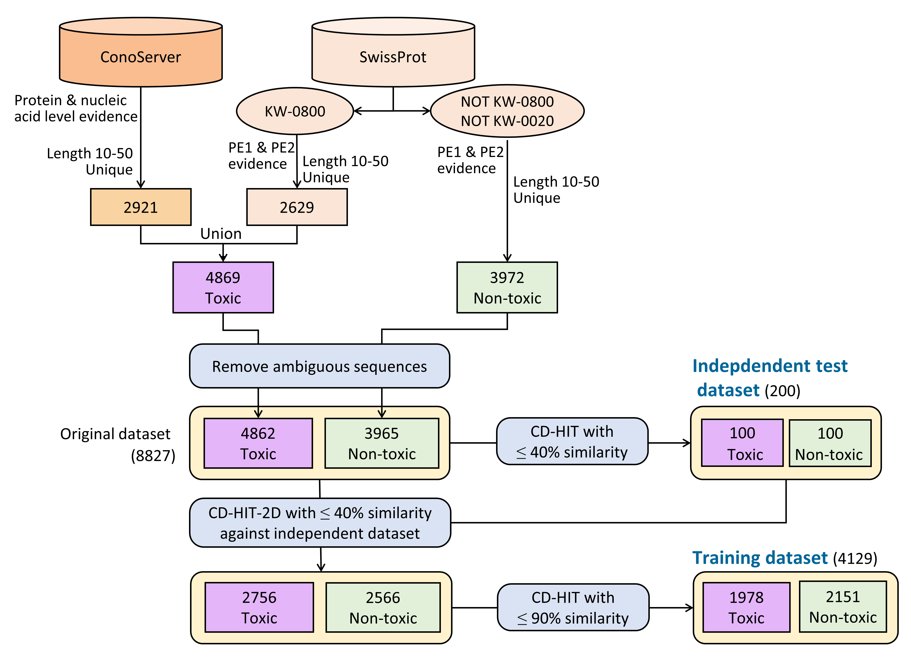

## Data used in the development stage of ToxTeller

_training_dataset.fasta_ was used to optimize hyper-parameters and feature combinations.

_independent_dataset.fasta_ was used to confirm the effectiveness of the model development process.

The details for dataset construction are shown in the figure below.

